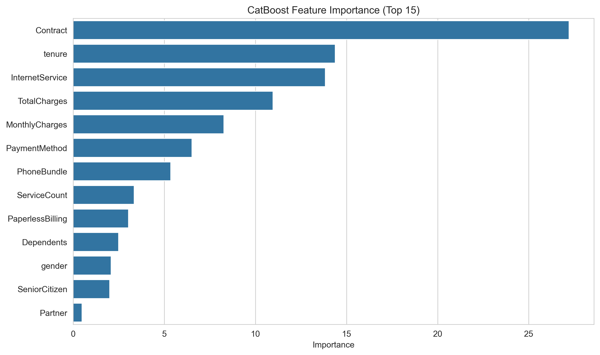

# 📊 Telecom Customer Churn Prediction

## 🌟 Project Overview
This project focuses on predicting customer churn in the telecom industry using machine learning.

## 📈 Visual Insights from the Notebook

### 1. Churn Distribution
This chart shows the balance of our dataset between customers who stayed and those who left.

### 2. Churn Analysis by Contract & Service
A heatmap revealing which customer segments are at the highest risk.

### 3. Model Performance
Our model's success in distinguishing between churn and non-churn cases.

### 4. Key Features Driving Churn (Important)
As we identified in the analysis, these are the top factors that influence a customer's decision.

## 🛠️ How to Run
1. Upload the `model_4.ipynb` and all `.png` files to your repository.
2. Ensure you have the required libraries installed.
